## [0.x] 课程要求

- [ ] <font style="color:#000000;">AVL树的</font><font style="color:#000000;">delete</font><font style="color:#000000;">操作</font>
- [ ] 均摊分析课后习题
- [ ] B+树的删除
- [ ] backtracking课后习题
- [ ] 实现各种数据结构：尤其是AVL/Splay/红黑树
- [ ] 阅读并完成算法分析导论中关于分治算法的时间复杂度分析的原理及例题
- [ ] 代码实现DP中的OBST


## [1.x] 课程笔记
### [1.1.x] Lesson 1
#### [1.1.1.x] AVL Tree——平衡二叉树之一

为了防止出现——按某种序列Insert后出现极端情况的BST树——的情况而需要添加balance的条件，而AVL就是一种比较古老的平衡条件

**<font style="color:#000000;">【Definition】</font>**<font style="color:#000000;">一棵AVL树是其每个节点的</font>**<font style="color:#000000;">左子树和右子树的高度最多差一的BST</font>**<font style="color:#DF2A3F;">（空树的高度定义为-1）</font>

**<font style="color:#000000;">【Definition】</font>**<font style="color:#000000;">Balance Factor：</font>**<font style="color:#000000;">BF(node) = Height(left) - Height(right)</font>**

<font style="color:#000000;">   所以在一棵AVL树中，BF（node）为</font>**<font style="color:#000000;">1，-1，0</font>**

**<font style="color:#DF2A3F;">📣</font>** **<font style="color:#DF2A3F;">注意：</font>**

1. <font style="color:#000000;">AVL树是一种特殊的BST，所以</font>**<font style="color:#000000;">兼容所有BST的特性</font>**<font style="color:#000000;">；</font>
2. <font style="color:#000000;">AVL树多了</font>**<font style="color:#000000;">平衡</font>**<font style="color:#000000;">的限制，所以进行</font>**<font style="color:#000000;">“增、删、改、查”</font>**<font style="color:#000000;">的操作时需要额外保持</font>**<font style="color:#000000;">平衡</font>**

> **Tree rotation** is an operation on a binary tree that changes the structure without interfering with the order of the elements.
>

**<font style="color:#000000;">rotation</font>**<font style="color:#000000;">使我们能在</font>**<font style="color:#DF2A3F;">“增”</font>**<font style="color:#000000;">时保持AVL树的性质，假设我们需要重新平衡的节点为α，则α“不平衡”的情况有以下四种：</font>

1. <font style="color:#0C68CA;">对α的左儿子的左子树进行一次插入——外侧单旋转</font>
2. <font style="color:#ED740C;">对α的左儿子的右子树进行一次插入——内侧双旋转</font>
3. <font style="color:#ED740C;">对α的右儿子的左子树进行一次插入——内侧双旋转</font>
4. <font style="color:#0C68CA;">对α的右儿子的右子树进行一次插入——外侧单旋转</font>
    
- **单旋转**

$T(N) = O(|V|^3)$

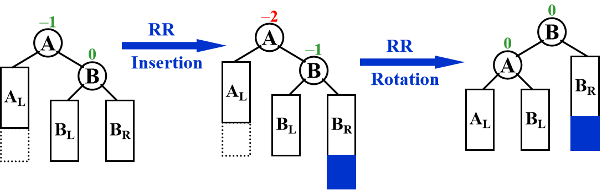

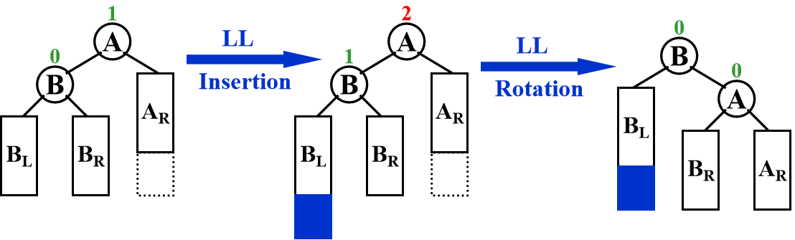

    
- **双旋转**

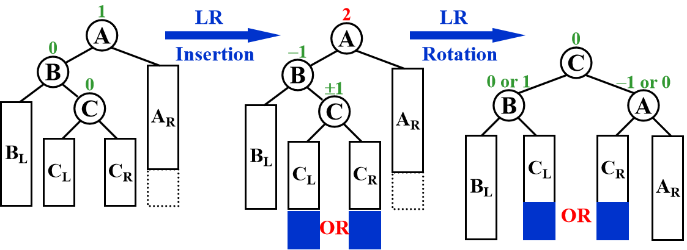


**<font style="color:#DF2A3F;">📣</font>** **<font style="color:#DF2A3F;">注意：</font>**

1. **<font style="color:#000000;">节点之间的左右关系不会改变</font>**
2. **<font style="color:#000000;">双旋转</font>****<font style="color:#DF2A3F;">关注</font>****<font style="color:#000000;">造成不平衡的插入节点在左子树还是右子树</font>**
3. **<font style="color:#DF2A3F;">关注</font>** **<font style="color:#000000;">被旋转的节点——B(单)/C(双)</font>**

h到底是多少？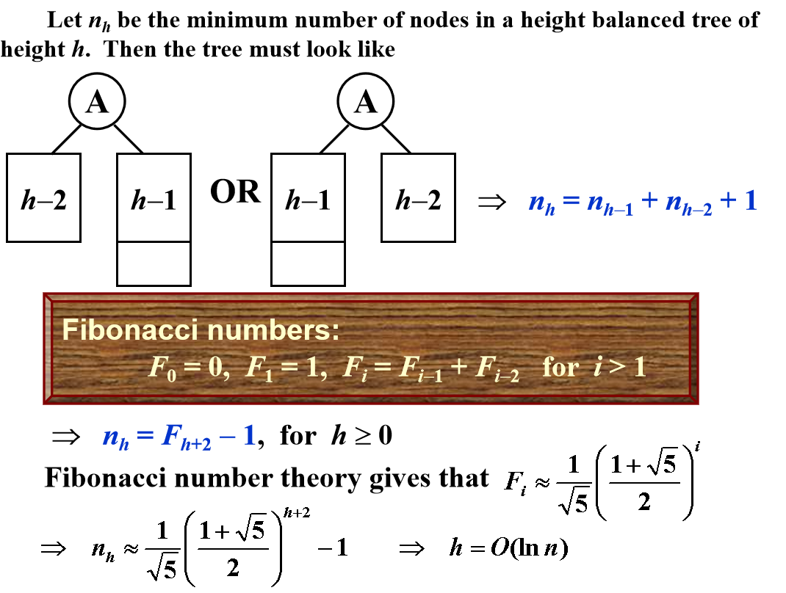


#### [1.1.2.x] Splay Tree——平衡二叉树之二

为了使**BST**在进行<font style="color:#DF2A3F;">“查/删”</font>时保持**摊还分析**下的对数时间复杂度（至于为什么要保持摊还分析下的而不是平均或最坏见第三部分），对BST的查找操作进行改造，称为“splay(伸展)”

> 	个人觉得思想上十分类似并查集的“路径压缩”
>

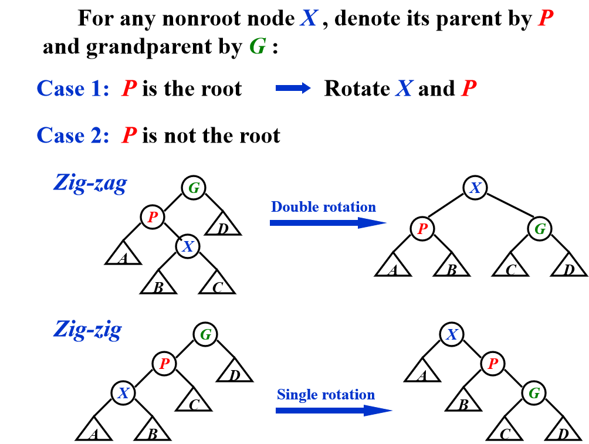

**<font style="color:#DF2A3F;">📣</font>** **<font style="color:#DF2A3F;">注意：Zig-zag可以转化成case1，Zig-zig不行</font>**

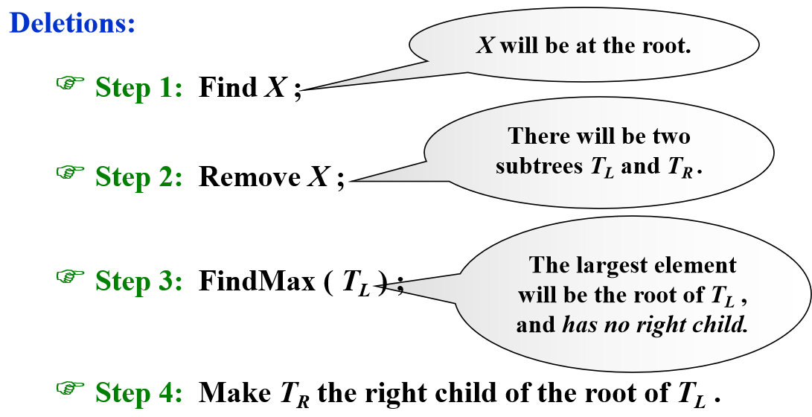


#### [1.1.3.x] Amortized Analysis


**均摊分析有三种方法：Aggregate analysis、Accounting method、Potential method**

+ **Aggregate analysis（聚合法）**

考虑下面的例子：

关键思想：每个被push的元素只能被pop一次，将n个元素看作整体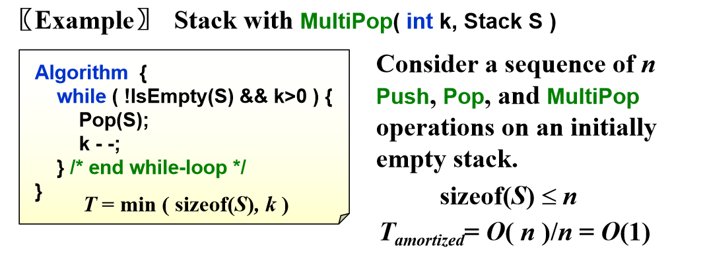

也就是说，**<font style="color:#DF2A3F;">最坏情况不会连续出现，将所有元素看作整体分析</font>**

**<font style="color:#DF2A3F;"></font>**

+ **Accounting method**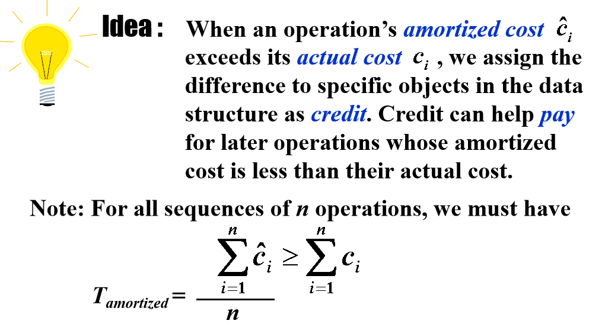

考虑例子：买股票或者存钱，原则是**不能亏钱**

关键思想：即使每天或盈或亏，但只要一段时间内总体上不少于本金就可以接受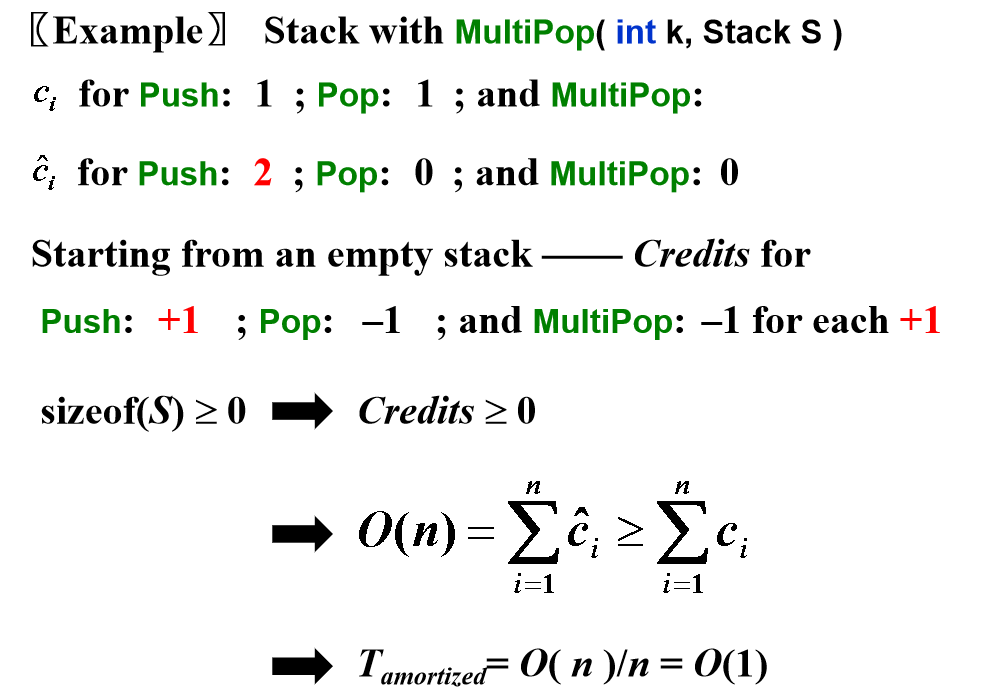

也就是说，**<font style="color:#DF2A3F;">credit之和大于等于0</font>**

**<font style="color:#DF2A3F;"></font>**

+ **Potential method**

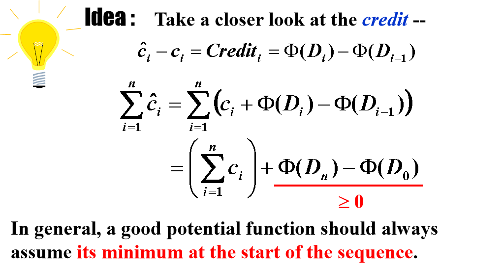

考虑到accounting method中需要为每种操作都设计一个均摊代价，对有大量操作的情况很不方便，所以势能法中只需要设计一个势能函数F(Di)，其中Di指的是对象的状态；

考虑例子：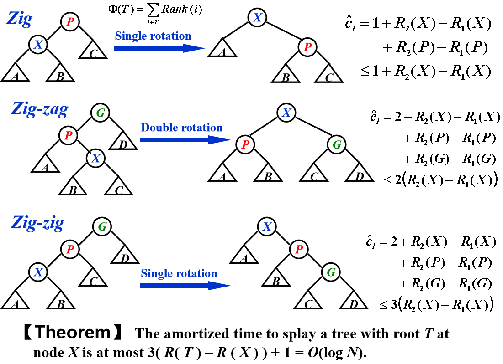

其中使用了引理：


### <font style="color:#DF2A3F;">[1.2.x] Lesson 2_陌生的天花板</font><font style="color:#DF2A3F;">👹</font>
#### [1.2.1.x] 红黑树——AVL树变种

**<font style="color:#000000;">【Definition】</font>**<font style="color:#000000;">满足下面</font>**五条性质**的 **<font style="color:#DF2A3F;">BST</font>** 称为红黑树：

1. 每个节点**非红即黑**；
2. **根**节点必须着**黑色**；
3. 每个叶子节点为**黑色** **<font style="color:#DF2A3F;">(NIL/NULL)</font>**；
4. **<font style="color:#DF2A3F;">红色节点的儿子必须是黑色的；</font>**
5. **从任意节点开始到叶子节点上的所有路径上包含相同数量的黑色节点；**

**<font style="color:#DF2A3F;">📣</font>** **<font style="color:#DF2A3F;">注意：</font>**

1. 性质c中的“叶子节点”指的是哨兵节点(外部节点)；
2. 性质e<font style="color:rgb(0, 0, 0);">确保没有一条路径会比其他路径长出俩倍。因而，红黑树是相对是接近平衡的二叉树；</font>

**<font style="color:#000000;">【Definition】</font>** The black-height of any node x——**bh(x)**, is the number of black nodes on any simple path from x **(x not included) **down to a leaf.  **bh(Tree) = bh(root).**

**<font style="color:#000000;">【Definition】</font>** A red-black tree with N internal nodes has height at most 2ln(N +1).

**【Find】** 等同普通的BST

**【Insert】**

📢<font style="color:#601BDE;">这是一个侄子和叔叔之间的故事——可称之为</font>**<font style="color:#601BDE;">”叔侄不相容定律“</font>**

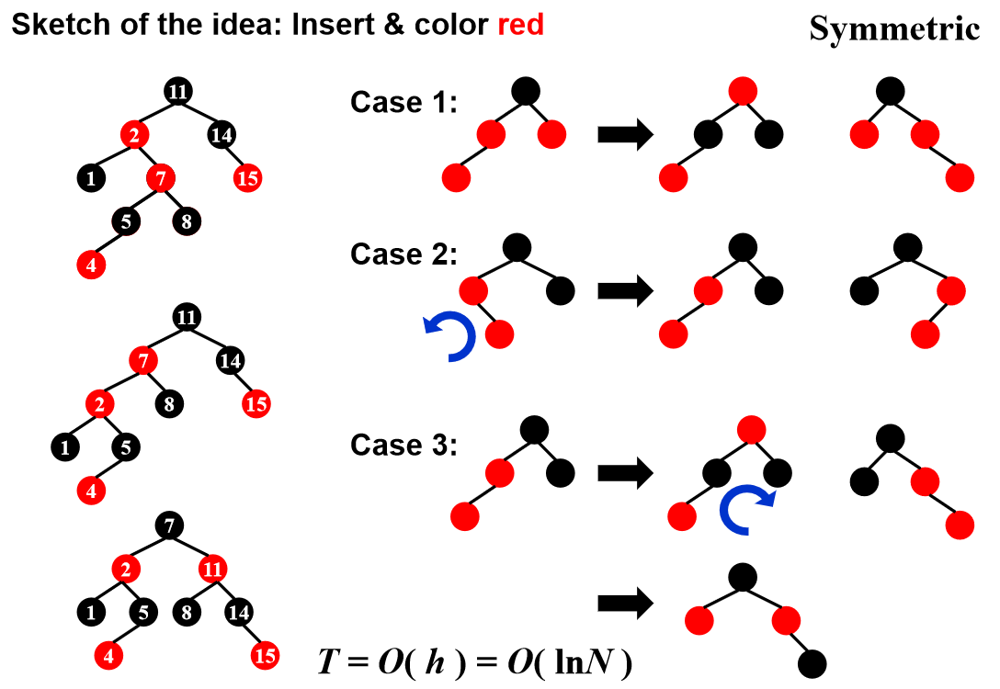

1. 为什么经过这些操作后还是一个红黑树？
2. 时间复杂度为什么是O(height)？
3. **自底向上和自顶向下的实现方法有哪些不同？**_<u><font style="color:#DF2A3F;">自顶向下需要对case-1进行迭代</font></u>_

**<font style="color:#DF2A3F;">📣</font>** **<font style="color:#DF2A3F;">注意：只有case-1会进入循环，case-2会转化为case-3，而case-3直接解决问题；</font>**

**【Delete】**

删除有三种情况：

1. 叶子节点：直接删除；
2. degree=1节点：交换儿子和本身的键值，然后删除儿子；
3. degree=2节点：
        1. 交换该节点与其左子树的最大值或右子树的最小值；
        2. 删除被交换的叶子节点；

**综上，所有删除操作均可转化为删除一个叶子节点；而删除红色节点不破坏性质，因此只考虑删除黑色；**

为了保持被删除节点所在的子树的性质5不被破坏，我们选择在被删除节点上增加一重黑色，下面考虑在此基础上的四种情况；

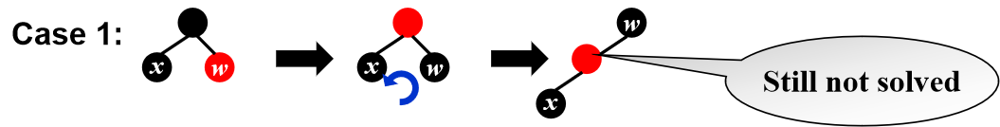

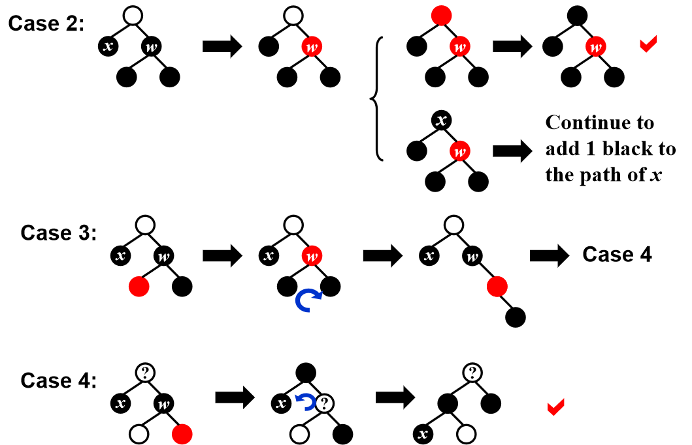

可参考的其他文章：1. [自顶向下红黑树 C语言实现——知乎](https://zhuanlan.zhihu.com/p/438685053)

   2. [详细对比自顶向下与自底向上红黑树-C实现自顶向下插入与删除——CSDN](https://blog.csdn.net/yw8355507/article/details/48932359)


### [1.3.x] Lesson 3
#### [1.3.1.x] B+ Tree——奇怪的查找树
**<font style="color:#000000;">【Definition】</font>**<font style="color:#000000;">满足下面</font>**结构性质**的树称为**阶为M的B+树**：

1. 树的根或者是叶子，或者其儿子数在 $[2,M]$ 之间；
2. 除根外，所有非树叶节点的儿子数在 $\lceil M/2 \rceil$ 和 $M$ 之间；
3. 所有的树叶都在相同的深度上；
4. **Assume each nonroot leaf also has between **$\lceil M/2 \rceil$** and M elements.**
5. **所有数据存储在叶子节点上；**
6. **所有内部节点上均含有：**
                    1. 指向该节点各儿子的指针 $P_1, P_2, P_3, \dots, P_M$ <font style="color:#585A5A;">(可能有NULL)</font>;
                    2. 分别代表在子树 $P_2, P_3, \dots, P_M$ 中的最小键值 $k_1,k_2,k_3,\dots,k_{M-1}$ ；
7. 所有树叶的**内部和树叶之间**，键值都是**从左到右严格递增**的；


【Find】

和BST类似，内部节点上的 $O(log_{\lceil M/2 \rceil}N)$ 个键值正好将其所有子节点上的偏序数据分为M块，因此B+树的查询操作的时间复杂度为 $O(log_{\lceil M/2 \rceil}N)$ ；

【Insert】

和BST类似，需要进行回溯更新内部节点键值；

冲突解决方法（若节点的children个数超过限制）：

            1. 分裂该节点，并向上递归更新；

优化方法：

            1. 探查同一父亲的其他子树中是否还有空间；
            2. 兄弟子树均饱和后再进行分裂；

#### [1.3.2.x] Inverted File Index

### [1.4.x] Lesson 4
#### [1.4.1.x] Leftist Heaps——为了加速堆的合并

**<font style="color:#000000;">【Definition】</font>**<font style="color:#000000;">满足下列性质的二叉树</font>称为左倾堆（树）（leftist heaps）：

_<u>堆序性质：与二叉堆相同，可分为最小堆/最大堆；</u>_

**<font style="color:#000000;">【Definition】</font>** The null path length, $Npl(X)$, of any node $X$ is the length of the shortest path from $X$ to a node without two children.  Define $Npl(NULL) = –1$.

**<font style="color:#DF2A3F;">【NOTE】</font>** $Npl(X) = Npl(C)+1$ for all children of $X$

<u>结构性质：对堆中的每个节点X，其左右儿子满足 </u> $Npl(lc) \ge Npl(rc)$；

**<font style="color:#000000;">【Theorem】</font>** A leftist tree with $r$ nodes on the right path must have at least $2^r-1$ nodes.

**【Note】** The leftist tree of $N$ nodes has a right path containing at most $\lfloor log(N+1) \rfloor$ nodes.

**【Merge】——O(logN)**

--recursive version

1. Merge( H1->Right, H2 )->递归入口
2. Attach( H2, H1->Right )
3. Swap(H1->Right, H1->Left ) if necessary
4. 递归出口->Merge时出现一棵空树

--iteration version

1. Sort the right paths without changing their left children；
2. Swap children if necessary；

注意：自底向上Swap更新，如果自顶向下Swap会改变right path上的节点使得下一步没法进行下去；

**【DeleteMin】**

1. delete the root;
2. merge the two subtrees of the original root;


#### [1.4.2.x] Skew Heaps——leftist heap的简单版本

**<font style="color:#000000;">【Definition】</font>**<font style="color:#000000;">满足下列性质的二叉树</font>称为斜堆（skew heaps）：

_<u>堆序性质：与二叉堆相同，可分为最小堆/最大堆；</u>_

_<u>结构性质：每次Merge操作都交换左右子树，除非当前节点是右路径上的最大节点；</u>_

**【Advantage】**：Skew heaps have the advantage that no extra space is required to maintain path lengths and no tests are required to determine when to swap children.

**【Note】**：It is an open problem to determine precisely the expected right path length of both leftist and skew heaps.

[**🔗** **如何用均摊分析证明其时间复杂度？？？**](https://www.cnblogs.com/halifuda/p/14364632.html)

**有几个难点：**

1. **势能函数的构造方法；其他方法为什么不行？**
2. **右路径上轻重节点合并后的转换；**
3. **轻节点的渐进上界？出现重节点不会减少右路径上轻节点的个数；**


### [1.5.x] Lesson 5
#### [1.5.1.x] Binomial Queue

**【目的】**

在左偏树和斜堆中插入一个元素的时间复杂度为O(logN)，但是构建一个N个元素二叉堆的时间复杂度为O(N)，均摊到每个元素就是O(1)，因此二项队列的目的是达到常数时间的插入操作并保持较好的合并操作复杂度；


**<font style="color:#000000;">【Definition】</font>**<font style="color:#000000;">满足下列性质树称为二项队列（Binomial Queue）</font>：

1.  满足堆的顺序性质，最小元素/最大元素；
2. 结构性质上，二项队列不是一棵堆序树，而是堆序树的森林，此时森林中的每棵树被称为二项树

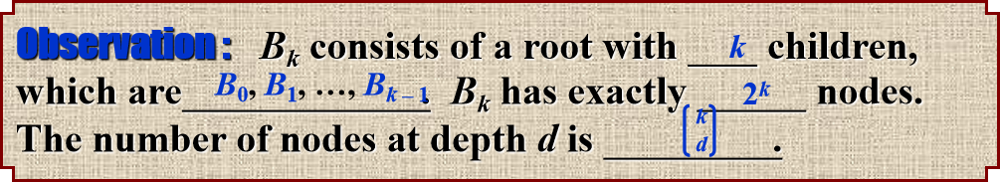


方法：将size表示为二进制数

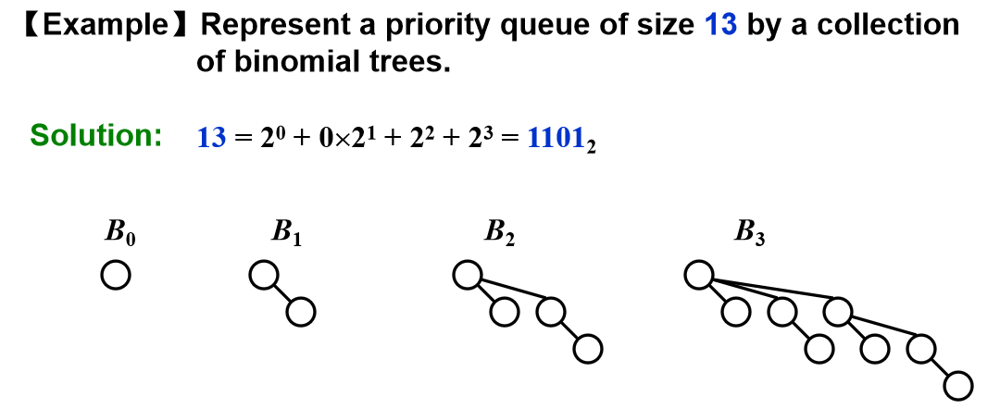

**【FindMin】**

Solution1：最小元素存在于森林中的树根上，所以遍历树根，时间复杂度为O(logN);

Solution2：维护一个最小元素，在进行merge或者delete操作时更新；

**【Merge】**

基本思想：合并高度相同的树，**类似二进制加法**；>> 二项队列中的树需保持高度排序

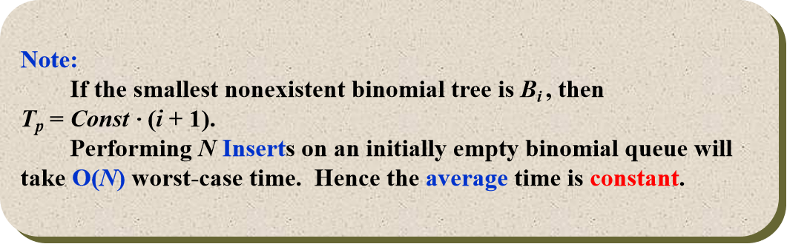

**【DeleteMin】**

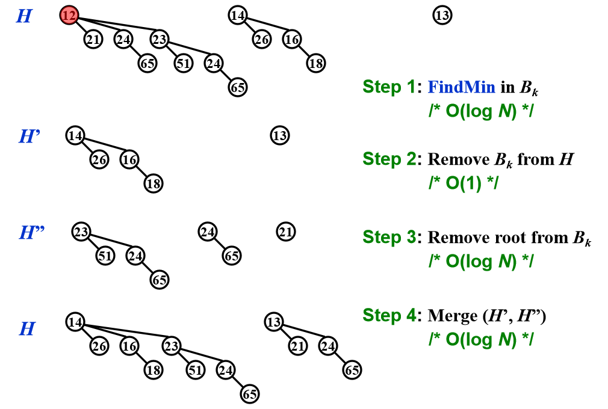

**【Implemention】**

要求：数组实现

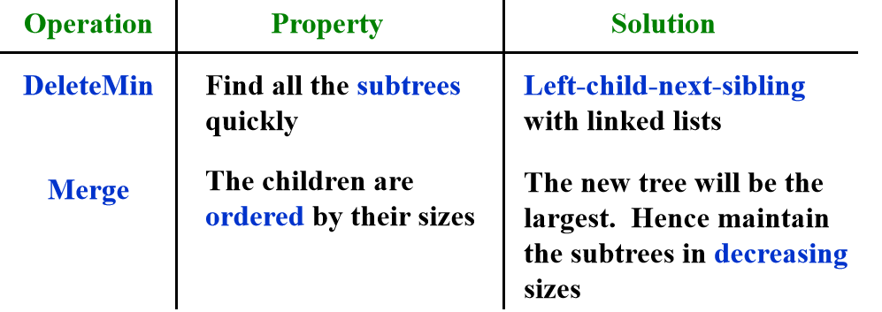

Q1：为何选择”左儿子右兄弟“而不是普通的二叉树？

A1：因为二项队列的目的在于简化查询操作，不在意访问队列中的任意一个元素，所以只需要左儿子右兄弟；

Q2：为何选择从左到右从大到小的高度安排？

A2：从merge操作考虑，两个高度相同的树相连，从小到大意味着需要遍历其中一个树的所有子树从而找到最大的那个，并将新的最大子树塞进去，而从大到小只需要直接将根节点较大的子树放在开头就行；

 从delete角度考虑，删除一个元素后，不管是高到低还是低到高都需要将被删除最小root的树中的所有字数都遍历一遍放入队列中，因此没有区别；


### [1.6.x] Lesson 6
#### [1.6.1.x] Backtracking——Theory
> 解决一个问题的可靠想法是穷举所有可能情况，逐一验证，排除错误情况，找到所有正确的答案，但是这样的方法不仅效率极低，而且对可能情况很多的问题耗时过大，因此我们需要更聪明的方法。
>

<font style="color:#000000;">【基本思想】</font>**<font style="color:#000000;">回溯</font>**<font style="color:#000000;">使我们能够</font>**<u><font style="color:#000000;">中途结束</font></u>**<u><font style="color:#000000;">对某些已知不可能情况的</font></u>**<u><font style="color:#000000;">彻底的</font></u>**<u><font style="color:#000000;">显示检查</font></u><font style="color:#000000;">（pruning：在一步内删除一大组可能性）；</font>

<font style="color:#000000;">【基本方法】</font>

1. <font style="color:#000000;">设已有部分答案</font> $(x_1,x_2,x_3,\dots,x_i)$ <font style="color:#000000;">，其中</font> $x_k \in S_K$ <font style="color:#000000;">，</font> $1 \le k \le i \le n$ <font style="color:#000000;">；</font>
2. <font style="color:#000000;">将</font> $x_{i+1}^j \in S_{i+1}$ <font style="color:#000000;">加入到答案中，检查</font> $(x_1,\dots,x_{i+1}^j)$ <font style="color:#000000;">是否可能</font><font style="color:#8A8F8D;">(satisfy the constraints)</font><font style="color:#000000;">：</font>
    1. <font style="color:#000000;">若可能，则继续加入下一个</font> $x$ <font style="color:#000000;">;</font>
    2. <font style="color:#000000;">若不可能，则从答案中删除</font> $x_{i+1}^j$ <font style="color:#000000;">，并尝试下一个</font> $x_{i+1}^{j+1} \in S_{i+1}$ <font style="color:#000000;">；如果所有的</font> $x_{i+1} \in S_{i+1}$ <font style="color:#000000;">都不满足条件，则回溯到答案</font> $(x_1,\dots,x_{i-1})$ <font style="color:#000000;">；</font>

【Template代码】

```c
/* 参数 i 表示当前答案的规模 */
bool Backtracking ( int i )
{   Found = false;
    if ( i > N )
        return true; /* solved with (x1, …, xN) */
    for ( each xi in Si ) { 
        /* check if satisfies the restriction R */
        OK = Check((x1, …, xi) , R ); /* pruning */
        if ( OK ) {
            Count xi in;
            Found = Backtracking( i+1 );
            if ( !Found )
                Undo( i ); /* recover to (x1, …, xi-1) */
        }
        if ( Found ) break; 
    }
    return Found;
}
```

##### 【 α - β pruning】MinMax剪枝中的常见策略
以α-剪枝为例，在44的位置我们需要一个最大值，而在40的level对方会选择最小值，此时如果我们探测到40的左儿子是40则不需要继续探测右儿子，因为如果右儿子小于40，则44的右儿子会比40小，那么最大值就是左儿子44，如果40的右儿子大于40，则44的右儿子还是40，则根节点选最大值依然是44，故可以直接剪枝；β-剪枝同理相反；

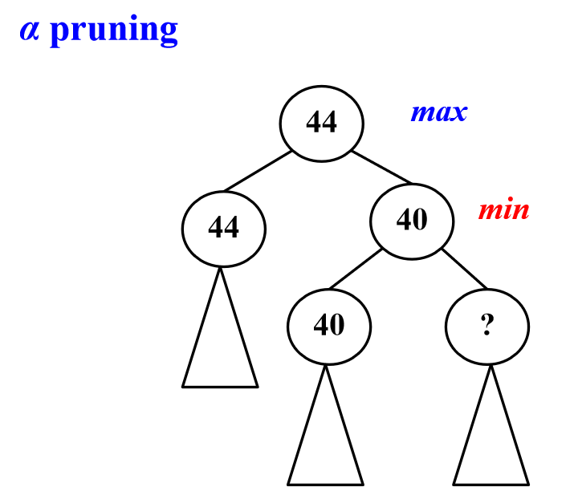
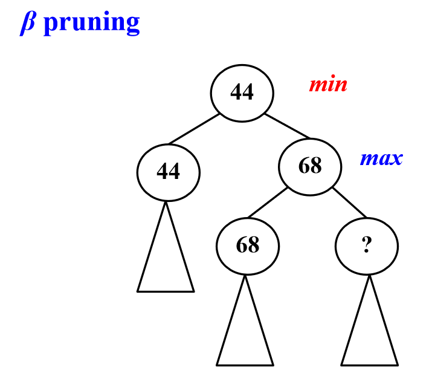
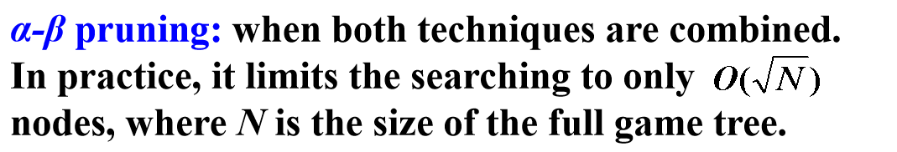

#### [1.6.2.x] Backtracking——Instants
##### 【八皇后问题】
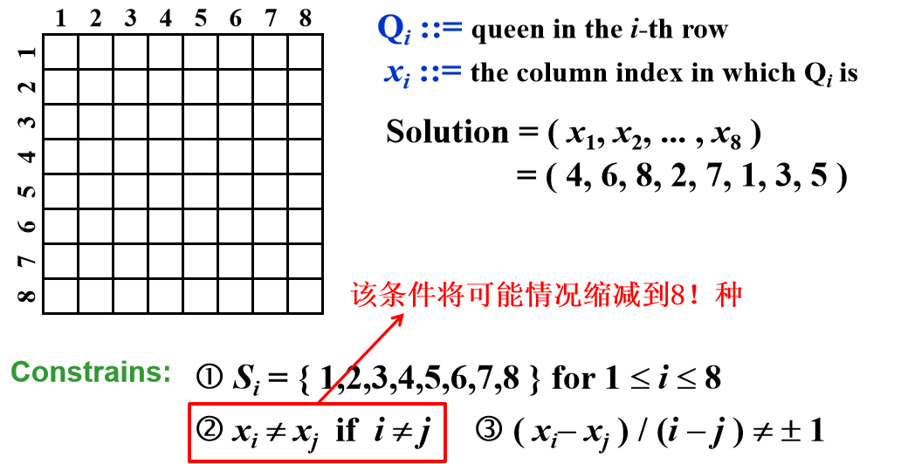

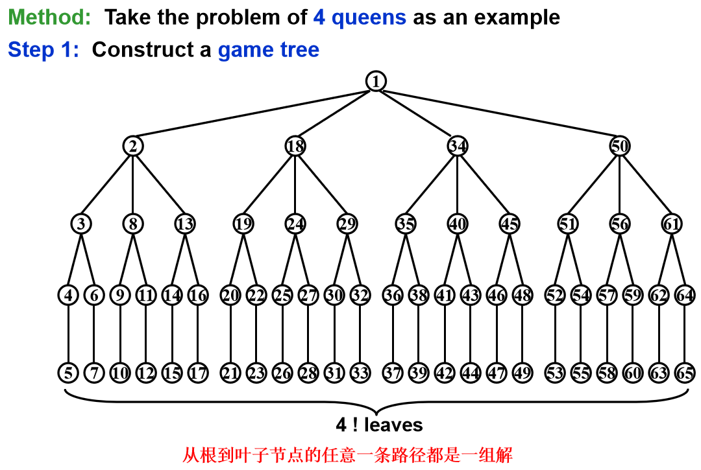
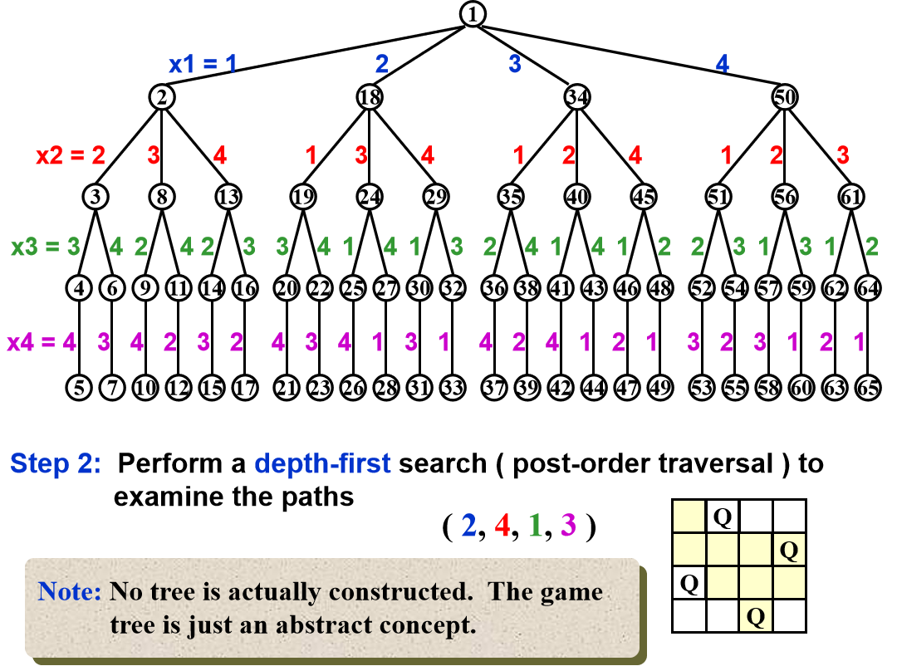

##### 【The Turnpike Reconstruction Problem】
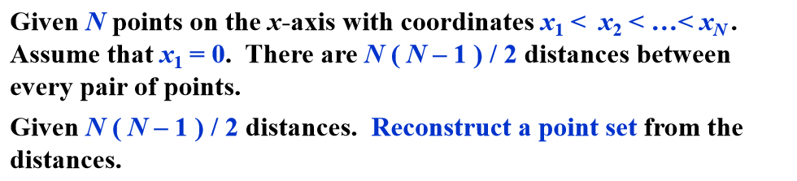

【解题思路】

根据给出的距离个数，可以通过 $C_N^2$ 计算出需要的站点个数N，然后关注最大距离可以确定出首尾两个点，其次再寻找次大距离进行迭代；

<u>其中，每增加一个站点，可以通过检查因该站点而新增加的距离是否满足题中的Distance Set剪枝；</u>

若无剪枝，则该算法的时间复杂度为 $2^{N-2}N^2$，首尾元素唯一，中间距离的元素都有两种可能；

若有剪枝，则

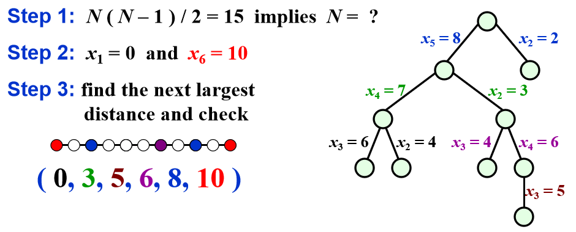

【代码实现】

```c
bool Reconstruct ( DistType X[ ], DistSet D, int N, int left, int right )
{ /* X[1]...X[left-1] and X[right+1]...X[N] are solved */
	bool Found = false;
	if ( Is_Empty( D ) )
		return true; /* solved */
	D_max = Find_Max( D );
	/*//---- option 1：X[right] = D_max ----//*/
	/* check if |D_max-X[i]| is in D for all X[i]s that have been solved */
	OK = Check( D_max, N, left, right ); /* pruning */
	if ( OK ) { /* add X[right] and update D */
		X[right] = D_max;
		for ( i=1; i<left; i++ )  Delete( |X[right]-X[i]|, D);		// 从D删去新加入的点产生的新distance
		for ( i=right+1; i<=N; i++ )  Delete( |X[right]-X[i]|, D);	// 从D删去新加入的点产生的新distance
		Found = Reconstruct ( X, D, N, left, right-1 );				// 递归下一层
		if ( !Found ) { /* if does not work, undo */
			for ( i=1; i<left; i++ )  Insert( |X[right]-X[i]|, D);		// 消除新加入点对D的影响
			for ( i=right+1; i<=N; i++ )  Insert( |X[right]-X[i]|, D);	// 消除新加入点对D的影响
		}
	}
	/* finish checking option 1 */
	if ( !Found ) { /* if option 1 does not work */
		/*//---- option 2: X[left] = X[N]-D_max ----//*/
		OK = Check( X[N]-D_max, N, left, right );
		if ( OK ) {
			X[left] = X[N] – D_max;
			for ( i=1; i<left; i++ )  Delete( |X[left]-X[i]|, D);		// 从D删去新加入的点产生的新distance
			for ( i=right+1; i<=N; i++ )  Delete( |X[left]-X[i]|, D);	// 从D删去新加入的点产生的新distance
			Found = Reconstruct (X, D, N, left+1, right );
			if ( !Found ) {
				for ( i=1; i<left; i++ ) Insert( |X[left]-X[i]|, D);		// 消除新加入点对D的影响
				for ( i=right+1; i<=N; i++ ) Insert( |X[left]-X[i]|, D);	// 消除新加入点对D的影响
			}
		}
		/* finish checking option 2 */
	} /* finish checking all the options */

	return Found;
}
```

##### 【Tic-tac-toe】
**<font style="color:#DF2A3F;">通过选择合适的“估价函数”来评估一方的局面优劣程度</font>**

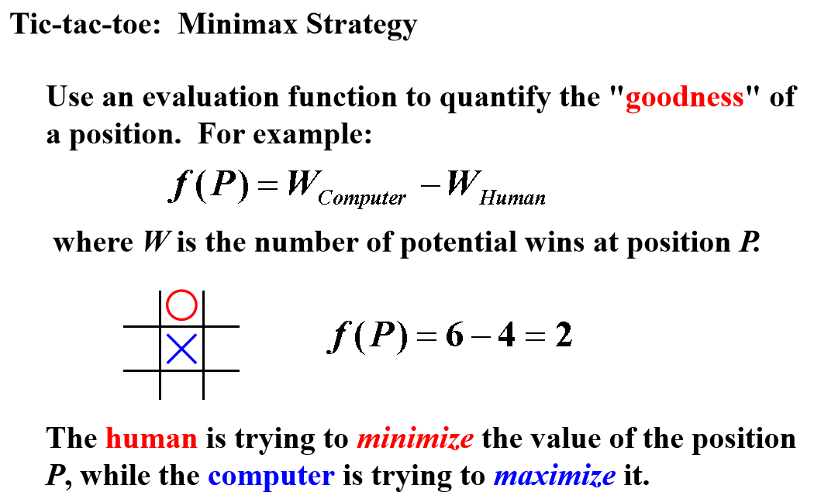

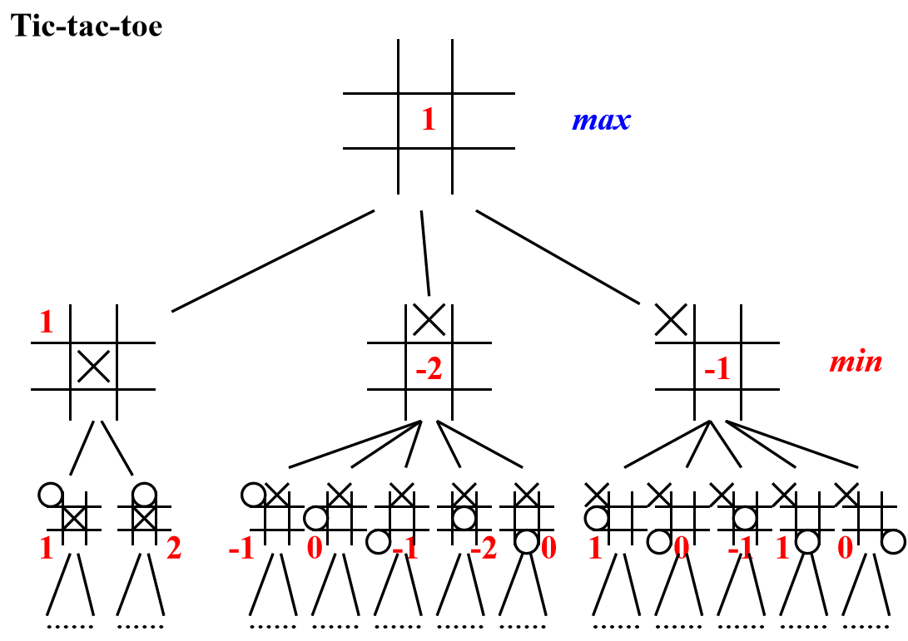

##### 【Eight Digits】
用哈希表存储已经出现过的状态

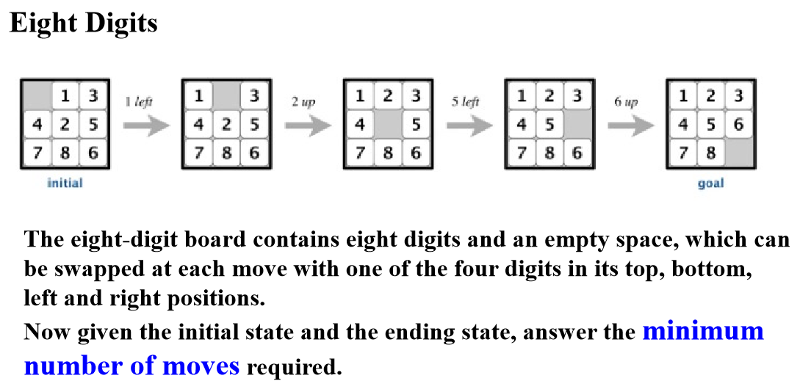

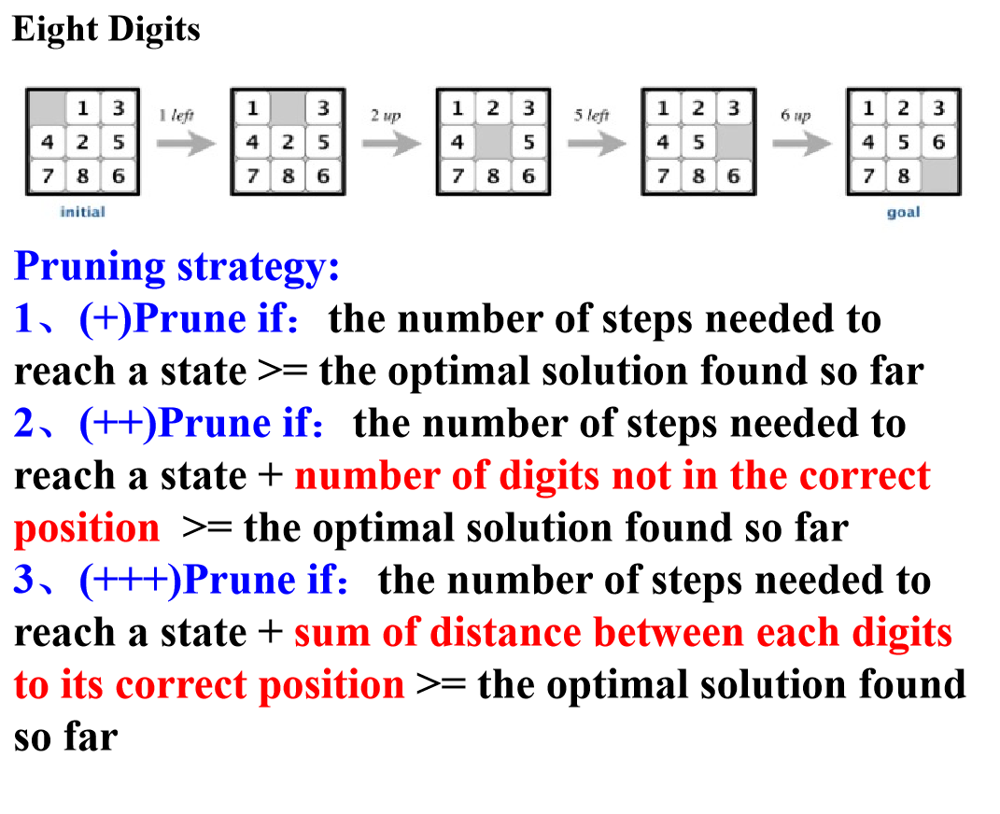

### [1.7.x] Lesson 7
> 要想搞懂一个算法，要问自己三个问题：
>
> 1. 问题的定义，输入输出？
> 2. 算法的步骤？
> 3. 算法的复杂度？
>

#### [1.7.1.x] Divide and Conquer——Theory
##### 【Defination】
Recursively:

**Divide** the problem into a number of sub-problems；

**Conquer** the sub-problems by solving them <u>recursively</u>；

**Combine** the solutions to the sub-problems into the solution for the original problem；

**General recurrence:** $T(N)=aT(N/b)+f(N)$


##### 【求解递推式】
> 需要忽略的细节：
>
> 1. 当规模较小时，$T(N)= \Theta(1)$；
> 2. $T(N/b)$ 是否是整数不影响分析，因此我们将其视为整数；
>

###### <font style="color:#DF2A3F;">Substitution method</font>
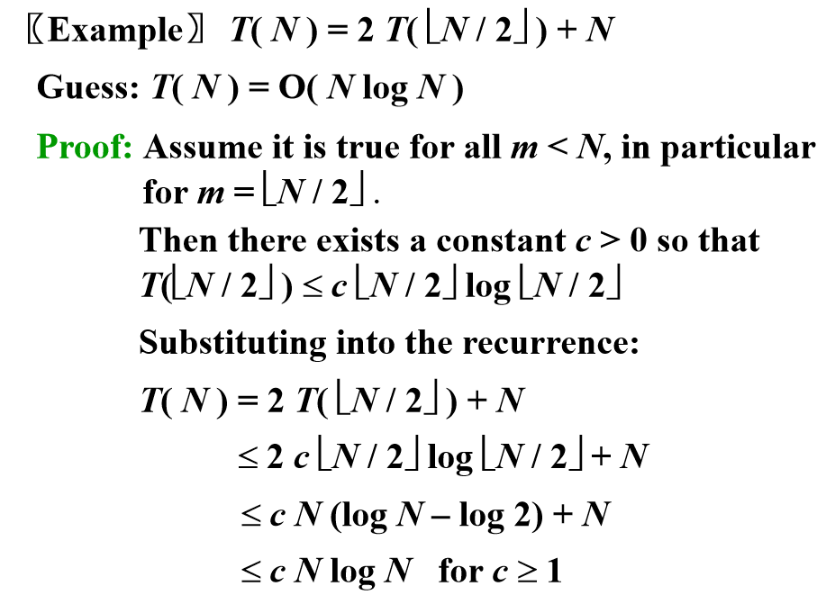

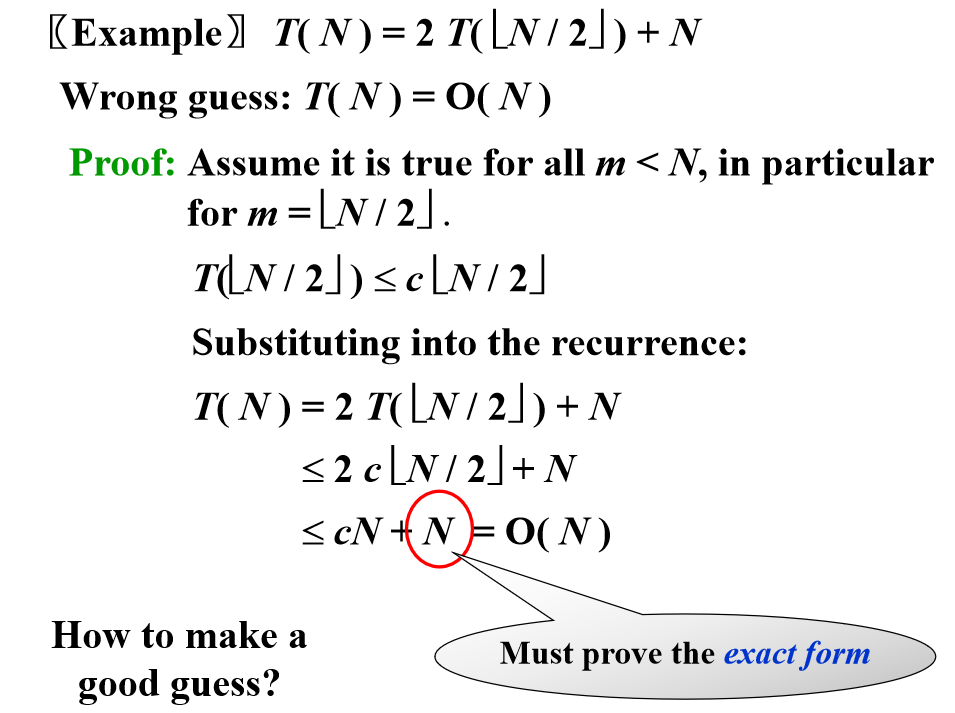

先猜，再用数学归纳法证明，但是**数学归纳法证明时要给出的是严格的上界，因此可以存在**-**(缩小上界)，但不能存在**+**(放大上界)**；

###### <font style="color:#DF2A3F;">Recursion-tree method——帮助猜测结果，最终证明要用数归</font>
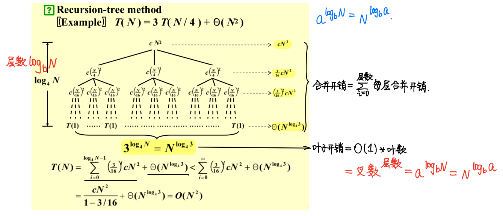

$a^{log_b^N} = a^{\frac{log_a^N}{log_a^b}} = (a^{log_a^N})^{\frac{1}{log_a^b}} = N^{log_b^a}$

###### <font style="color:#DF2A3F;">Master method</font>


具体证明见《算法导论》第四章

实际上比的是, **<font style="color:#DF2A3F;">合并所有子问题</font>** 的开销和 **<font style="color:#DF2A3F;">解决所有子问题</font>** 的开销；

_**<u><font style="color:#DF2A3F;">注意条件三的附加条件</font></u>**_


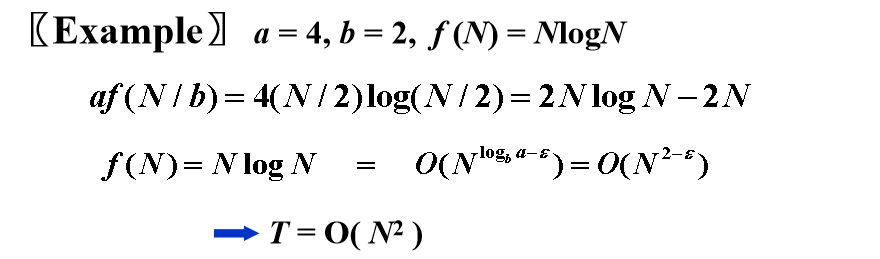


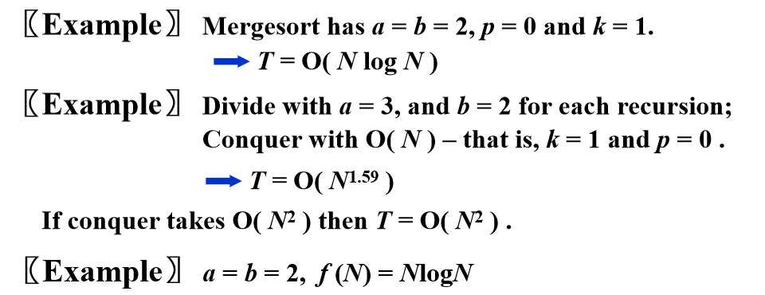

#### [1.7.2.x] Divide and Conquer——Instants
##### 【简单例子】
1. 最大子序列和—— $O(NlogN)$
2. 通过树的遍历构建树—— $O(N)$
3. 归并排序和快排—— $O(NlogN)$

##### 【Closest Points Problem】

    Given N points in a plane.  Find the closest pair of points.  (If two points have the same position, then that pair is the closest with distance 0.)

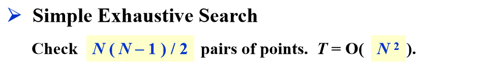

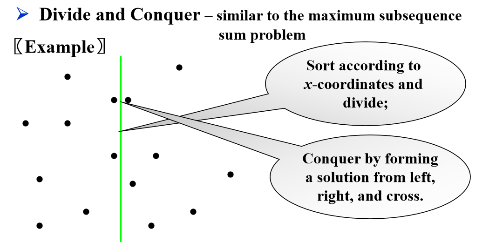

采用分治算法：

类似于最大子序列的分类方法；考虑<u>左边、右边、横跨左右</u>三种情况，递归的解决左右两边，并在合并时解决横跨两边；

**此时，$f(N) = cN^2$，时间复杂度为** $O(N^2)$； 

因此下面考虑对该算法进行类似剪枝的操作，不必 $\frac{N}{2} * \frac{N}{2}$ 次遍历；

**第一次剪枝：**

1. 先递归解决左右两边规模为 $\frac{N}{2}$ 的点，找出此时最小距离 $\delta$ ；
2. 遍历距离中线距离小于 $\delta$ 所有点；

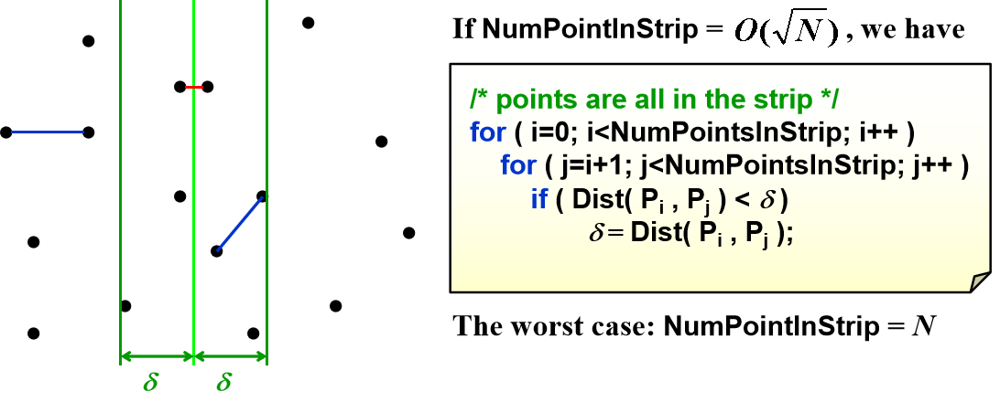

`strip`内的点数为 $O(\sqrt{N})$ 时，可以获得 $O(logN)$ 时间开销，最坏情况是`strip`内的点是 $O(N)$

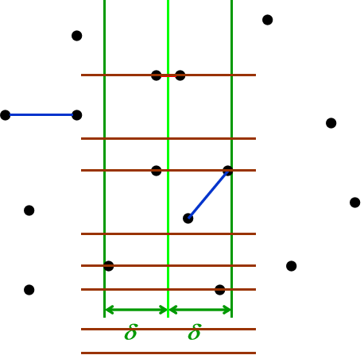
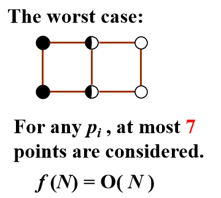
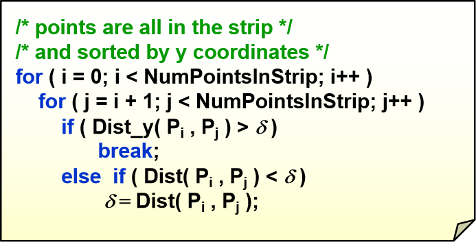

**第二次剪枝：**

1. 考虑Y-轴方向的剪枝，**需要对Y-轴方向的点排序**，由于同时需要进行X-轴方向的剪枝，<u>具体实现上可以维护两个队列</u>；

2. 最坏情况不存在N-1个点都塞在这个方框里，否则在分治一边的点时 $\delta$ 就会变小；最差是塞七个点（中线上会有重叠，且同一边可能会有点被重复考虑）；